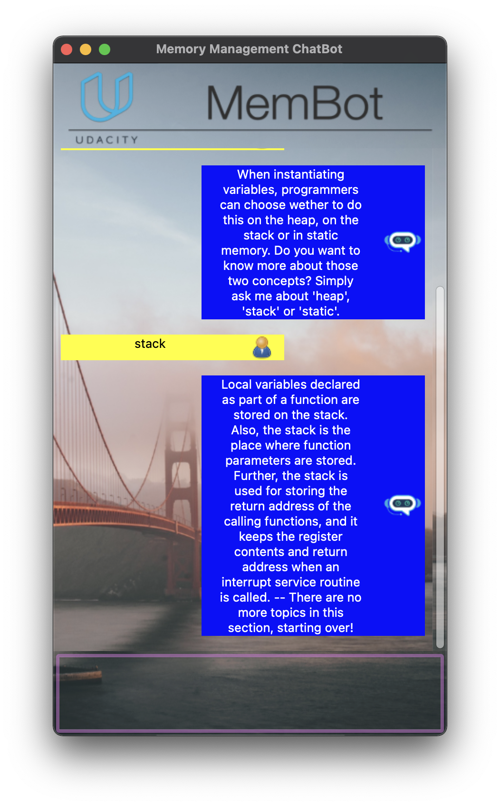

# ChatBot
[](https://opensource.org/licenses/MIT) [](https://svgshare.com/i/ZjP.svg) [](https://atom.io)

Welcome to the third project of Udacity's C++ Nanodegree!

In this project, I optimised a chatbot using modern C++ memory management tools (smart pointers, move semantics and correct memory allocation/deallocation).

<p align="center"></p>

## EnvironmentÂ
👉 macOS 12.0.1 Monterey with Intel Core i7 chip  
👉 Homebrew 3.3.5  
👉 cMake 3.21.3  
👉 GNU Make 3.81  
👉 C++ 17  
👉 Apple clang version 13.0.0  
👉 wxWidgets 3.1.5 installed with brew `brew install wxwidgets`

## Compiling and Running
### Compile
Create a `build` folder and change to that directory
```
mkdir build && cd build
```

Within the build directory run
```
cmake ..
make
```

### Running
The executable is within the `build` directory. You can run it as follows
```
./membot
```
